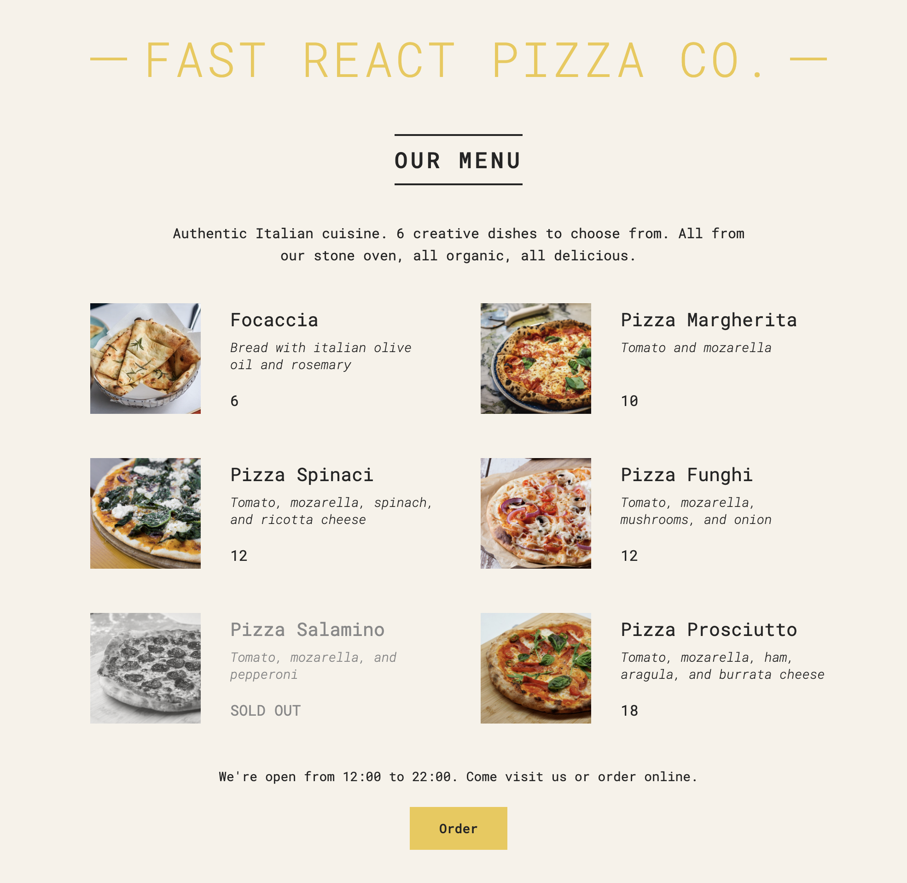

# "FAST REACT PIZZA CO" Project

- `Repository:` 01-Learn-react-pizza-menu
- `Type of Challenge:` learning React
- `Mode:` solo learn from online course on Udemy
- `Deployment:`[ Vercel](https://01-learn-react-pizza-menu.vercel.app/)

## Description

The goal of this project was to learn the basics of React. The project is a simple pizza menu built with React and styled with CSS. The project is part of the online course ["The Ultimate React Course 2023: React, Redux, & More"](https://www.udemy.com/share/108PTK3@svd7LSKS9ey6F-mAoiPwPf0maT7NoRyTUO4HqpNWgU6hsdF-ESPRYJMbg9njS0DY-g==/) by Jonas Schmedtmann on Udemy.

## Learning objectives of this project:

- Setting up a React project
- Creating components
- Passing data between components
- Using props
- Styling with CSS
- Rendering lists
- Conditional rendering
- Extracting JSK into a new component
- Destructuring props
- React fragments
- Setting classes and text conditionally

 

